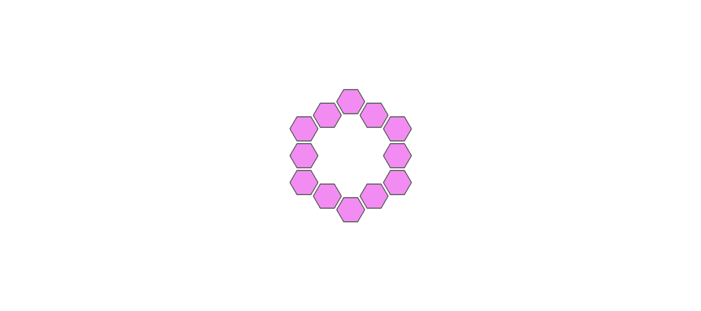
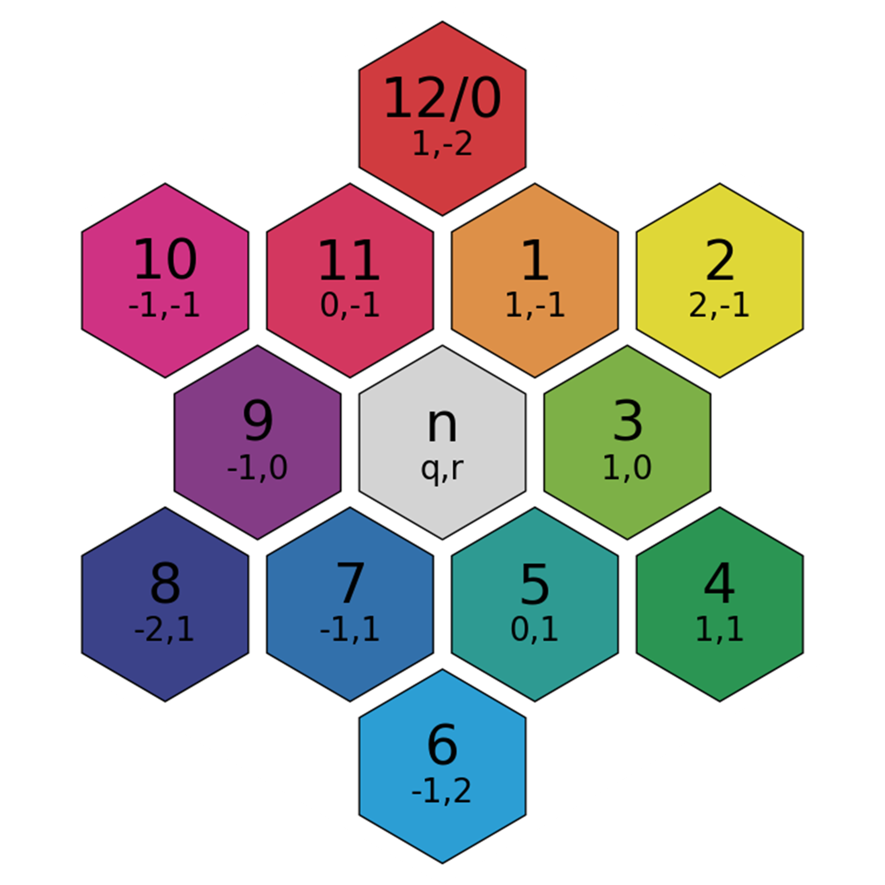
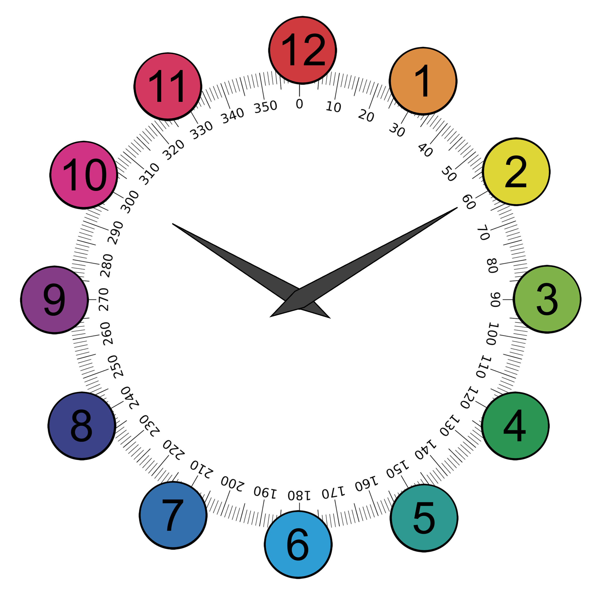
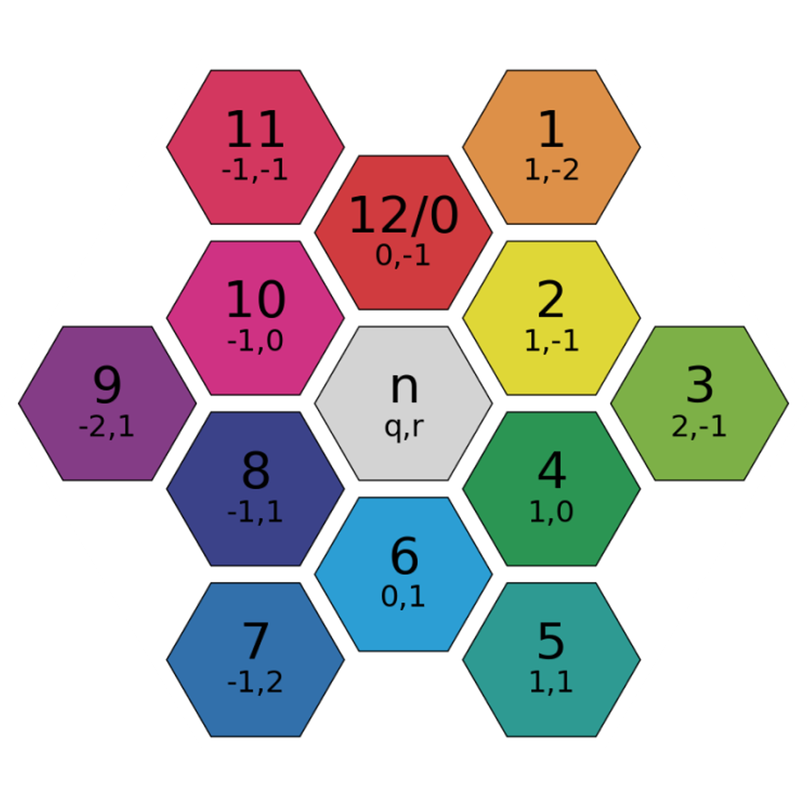

# **hexpy**

The purpose of **hexpy** is a hobby project that eases working with hexagonal grids in python, focusing on readable code which should be easy to use.



<!-- *The logo was created as an 
[**example**](https://github.com/ElisGrahn/hexpy/tree/master/examples/animate_logo) 
using **hexpy** together with PIL and pygame*. -->

> **Note:**
> This work has been heavily inspired by the beautiful work of [**redblobgames**](https://www.redblobgames.com/grids/hexagons/), who provide a fantastic post about ways to represent hexagonal grids with both illustrations and code examples.

## **Usage**

> Work in progress
<!-- <svg xmlns="http://www.w3.org/2000/svg" viewBox="0 0 100 30" fill="none">
    <text x="0" y="15" fill="#ACD97F">h</text>
    <text x="7" y="15" fill="#7FCCF2">e</text>
    <text x="14" y="15" fill="#F28CF2">x</text>
    <text x="20" y="15" fill="#3673A5">p</text>
    <text x="28" y="15" fill="#FFD342">y</text>

</svg> -->

- ### Creation

- ### **Navigation**

Since I personally found it quite challenging to wrap my head around navigating in hexagonal grids using the cube coordinate system, i wrote code and created visualizations that should make it somewhat easier.

For instance the clock- and angle-system by 
[Hex Chogi](https://www.chessvariants.com/hexagonal.dir/hexshogi/) featured in 
[Hexagonal chess](https://en.wikipedia.org/wiki/Hexagonal_chess#cite_note-Hexagonal_directions_as_cardinal_directions_of_a_clock_face-1)
was the inspiration for the visualizations below.

Pointy Hexclock | Regular Clock | Flat Hexclock |
:---:|:---:|:---:|
||

These systems can be accessed once a layout has been defined (if a custom one is used it defaults to pointy).

```Py
>>> from hexpy import Hex

>>> Hex.pointy_layout(10)

>>> # Direct neighbor
>>> Hex.hexclock(1)
Hex(q=2, r=-1, s=-1)

>>> # Diagonal neighbor
>>> Hex.o_clock(2)
Hex(q=1, r=0, s=-1)

>>> # Also for instances:
>>> h = Hex(1, 0)
>>> h.hexclock

```