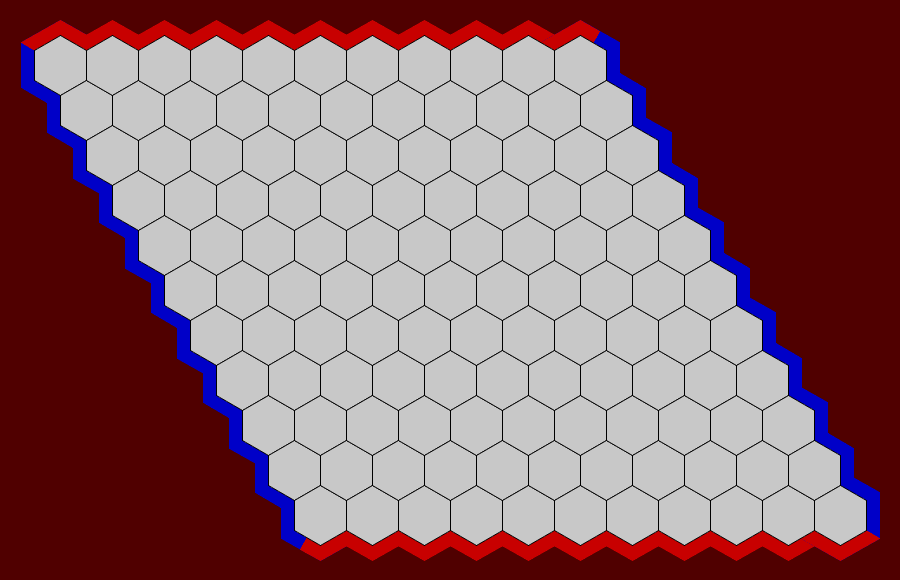
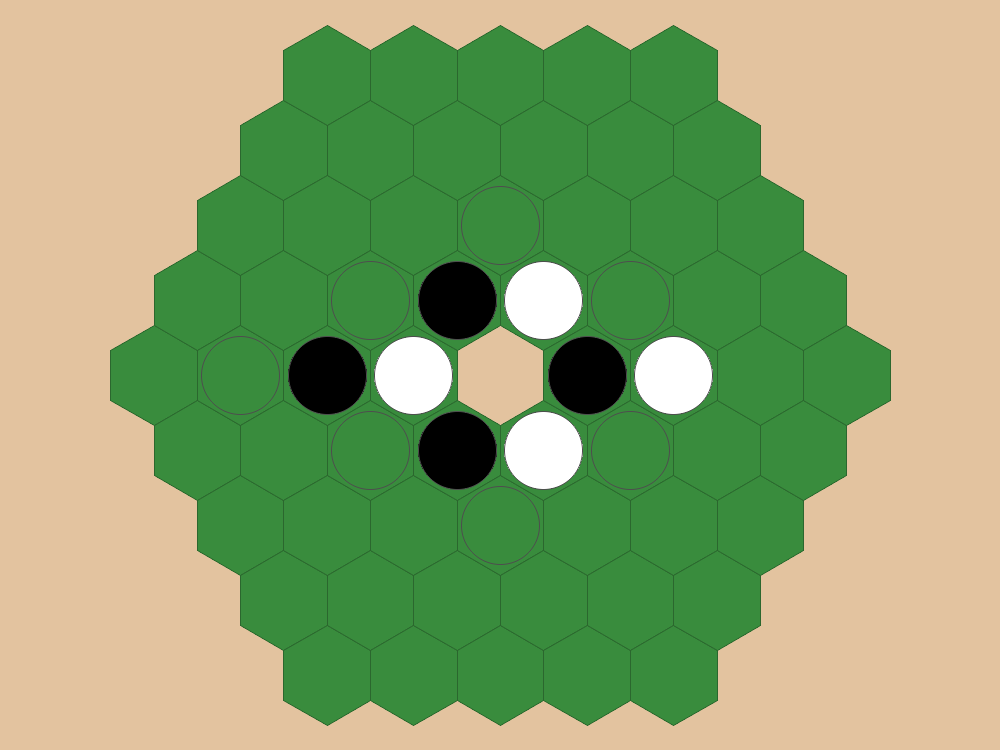
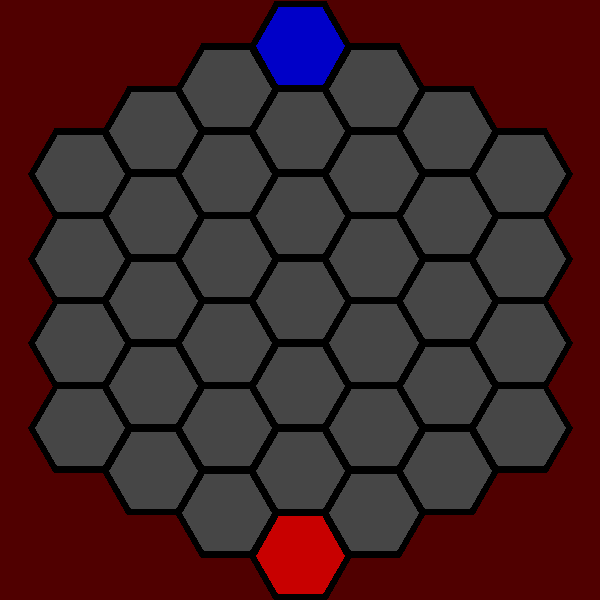

# **Examples of usage**

* [**hexlife**](./../examples/game_of_life/hexlife.py),
the classic [**Conway's Game of Life**](https://en.wikipedia.org/wiki/Conway%27s_Game_of_Life),
but in a hexagonal grid.

---

* [**hexnash**](./../examples/game_of_life/hexlife.py),
the classic [**Hex (board game)**](https://en.wikipedia.org/wiki/Hex_(board_game))

---

* [**hexothello**](./../examples/chess/hexchess.py), 
the classic [**Reversi**](https://en.wikipedia.org/wiki/Hexagonal_chess) 
but on a hexagonal board.

---

* [**hexchess**](./../examples/chess/hexchess.py),
for rules see: [**Hexagonal chess**](https://en.wikipedia.org/wiki/Hexagonal_chess) (UNFINISHED)

---

* [**hexxagon**](./../examples/hexxagon_game/hexxagon.py),
a simpler version of the mobile phone game:
[**Hexxagon - Board Game**](https://play.google.com/store/apps/details?id=se.esolutions.hexxagon&hl=sv&gl=US)
